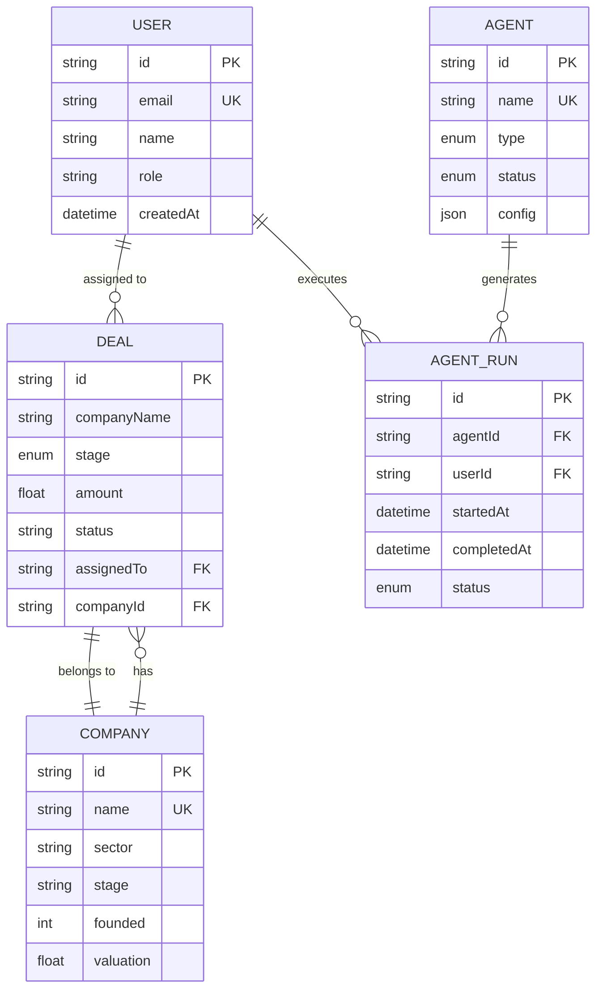

# Database Documentation

## Overview

PostgreSQL database with Prisma ORM for the Redstick Ventures Command Center.

## Entity Relationship Diagram



## Tables

### User

Stores user accounts and authentication.

| Field | Type | Constraints | Description |
|-------|------|-------------|-------------|
| id | String | PK, CUID | Unique identifier |
| email | String | UK, Indexed | User email address |
| name | String | | Full name |
| role | Enum | | ADMIN, PARTNER, ANALYST |
| password | String | | Hashed password |
| image | String? | | Profile image URL |
| createdAt | DateTime | | Account creation date |
| updatedAt | DateTime | | Last update date |

**Indexes:**
- email (unique)
- role (for filtering)

---

### Deal

Stores investment opportunities.

| Field | Type | Constraints | Description |
|-------|------|-------------|-------------|
| id | String | PK, CUID | Unique identifier |
| companyName | String | Indexed | Company name |
| stage | DealStage | Indexed | Pipeline stage |
| amount | Float? | | Investment amount |
| description | String? | | Deal description |
| source | DealSource | | Lead source |
| status | DealStatus | Indexed | ACTIVE, INACTIVE, ARCHIVED |
| companyId | String? | FK | Linked company |
| assignedTo | String? | FK, Indexed | Assigned user |
| createdAt | DateTime | | Creation date |
| updatedAt | DateTime | | Last update |

**Indexes:**
- stage (pipeline filtering)
- status (list views)
- assignedTo (my deals view)
- companyId (company lookup)

---

### Company

Stores portfolio companies.

| Field | Type | Constraints | Description |
|-------|------|-------------|-------------|
| id | String | PK, CUID | Unique identifier |
| name | String | UK, Indexed | Company name |
| sector | String | Indexed | Industry sector |
| stage | String | Indexed | Funding stage |
| website | String? | | Company website |
| description | String? | | Company description |
| founded | Int? | | Year founded |
| employees | Int? | | Employee count |
| investment | Float? | | Total investment |
| valuation | Float? | | Current valuation |
| status | CompanyStatus | Indexed | ACTIVE, ACQUIRED, IPO, SHUTDOWN |
| createdAt | DateTime | | Creation date |
| updatedAt | DateTime | | Last update |

**Indexes:**
- name (search)
- sector (filtering)
- status (portfolio views)

---

### Agent

Stores AI agent configurations.

| Field | Type | Constraints | Description |
|-------|------|-------------|-------------|
| id | String | PK, CUID | Unique identifier |
| name | String | | Agent name |
| description | String | | Agent description |
| type | AgentType | Indexed | SCREENING, RESEARCH, PORTFOLIO, etc. |
| status | AgentStatus | Indexed | ACTIVE, INACTIVE, ERROR, MAINTENANCE |
| config | JSON | | Agent configuration |
| lastRun | DateTime? | | Last execution time |
| successRate | Int | | Success percentage |
| totalRuns | Int | | Total executions |
| tokenUsage | Int | | API token consumption |
| createdAt | DateTime | | Creation date |
| updatedAt | DateTime | | Last update |

---

### AgentRun

Stores agent execution history.

| Field | Type | Constraints | Description |
|-------|------|-------------|-------------|
| id | String | PK, CUID | Unique identifier |
| agentId | String | FK, Indexed | Parent agent |
| userId | String? | FK | Triggered by user |
| status | RunStatus | | RUNNING, COMPLETED, FAILED |
| startedAt | DateTime | | Start time |
| completedAt | DateTime? | | End time |
| duration | Int? | | Execution duration (ms) |
| tokensUsed | Int | | Tokens consumed |
| output | String? | | Run output |
| error | String? | | Error message |

**Indexes:**
- agentId (agent history)
- userId (user activity)
- startedAt (recent runs)

## Enums

### DealStage
- INBOUND
- SCREENING
- FIRST_MEETING
- DEEP_DIVE
- DUE_DILIGENCE
- IC_REVIEW
- TERM_SHEET
- CLOSED
- PASSED

### DealStatus
- ACTIVE
- INACTIVE
- ARCHIVED

### UserRole
- ADMIN
- PARTNER
- ANALYST

### AgentType
- SCREENING
- RESEARCH
- PORTFOLIO
- OUTREACH
- DILIGENCE
- REPORTING

### AgentStatus
- ACTIVE
- INACTIVE
- ERROR
- MAINTENANCE
- RUNNING

## Relationships

### One-to-Many
- User → Deals (assignedTo)
- User → AgentRuns (userId)
- Company → Deals (companyId)
- Agent → AgentRuns (agentId)

### Many-to-One
- Deal → Company (companyId)
- Deal → User (assignedTo)
- AgentRun → Agent (agentId)
- AgentRun → User (userId)

## Query Examples

### Get deals with company info

```sql
SELECT d.*, c.name as companyName, c.sector
FROM Deal d
LEFT JOIN Company c ON d.companyId = c.id
WHERE d.status = 'ACTIVE'
ORDER BY d.createdAt DESC;
```

### Get portfolio metrics

```sql
SELECT 
  COUNT(*) as totalCompanies,
  SUM(investment) as totalInvested,
  AVG(valuation) as avgValuation
FROM Company
WHERE status = 'ACTIVE';
```

### Get agent run history

```sql
SELECT r.*, a.name as agentName
FROM AgentRun r
JOIN Agent a ON r.agentId = a.id
WHERE r.agentId = 'agent-id'
ORDER BY r.startedAt DESC
LIMIT 10;
```

## Migrations

### Creating a migration

```bash
npx prisma migrate dev --name add_new_field
```

### Applying migrations

```bash
npx prisma migrate deploy
```

### Reset database

```bash
npx prisma migrate reset
```

## Seeding

### Seed data location

`prisma/seed.ts`

### Run seed

```bash
npx prisma db seed
```

## Performance Optimization

### Connection Pooling

```env
DATABASE_URL="postgresql://...?connection_limit=10&pool_timeout=20"
```

### Query Optimization Tips

1. Use indexes for filtered fields
2. Select only needed fields
3. Use pagination for large datasets
4. Enable query logging in development
