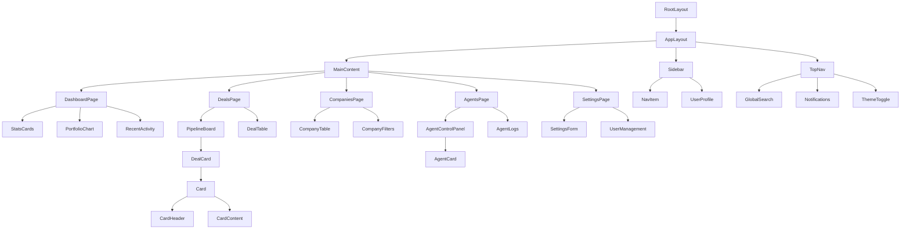
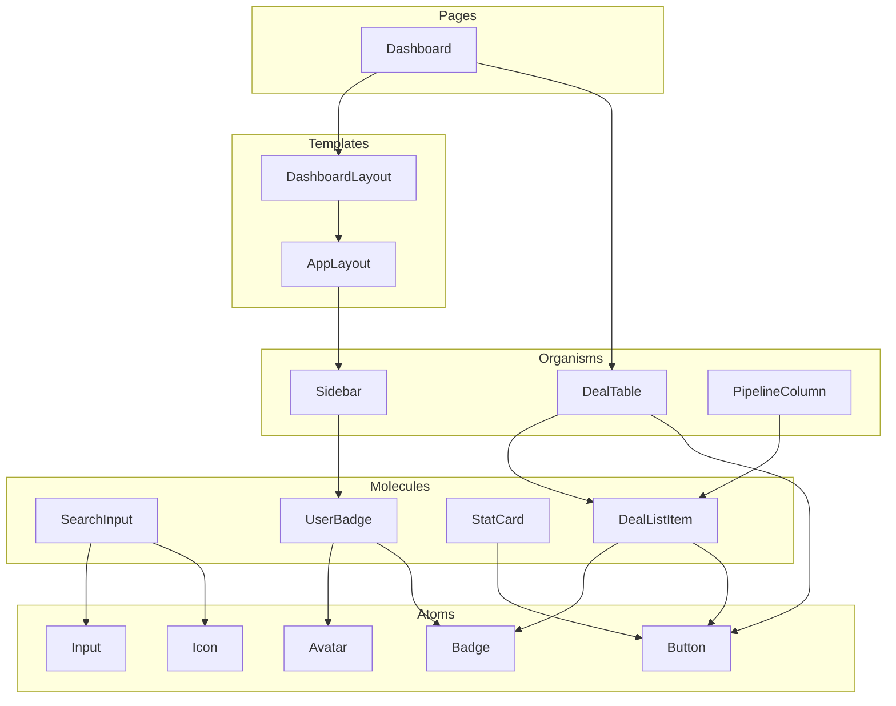
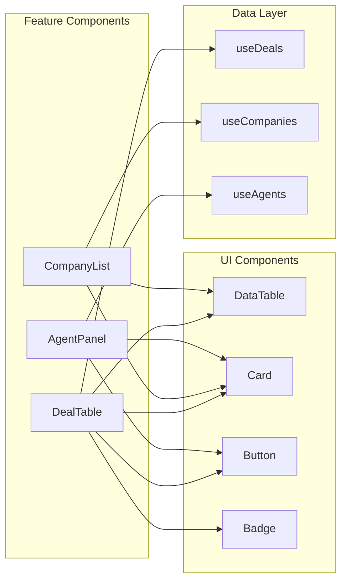
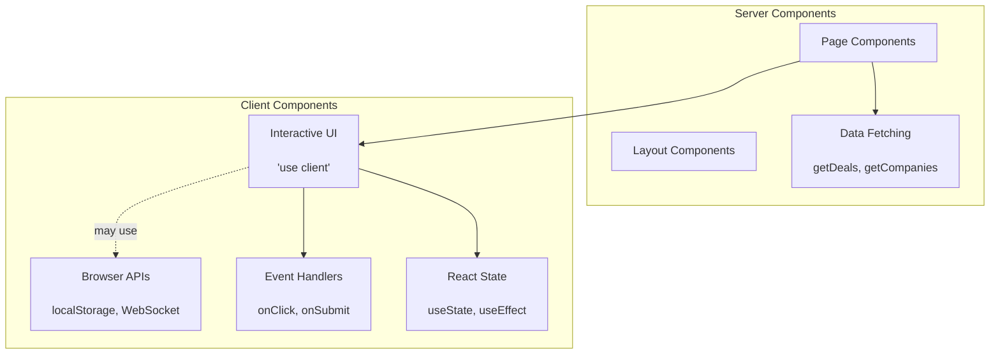
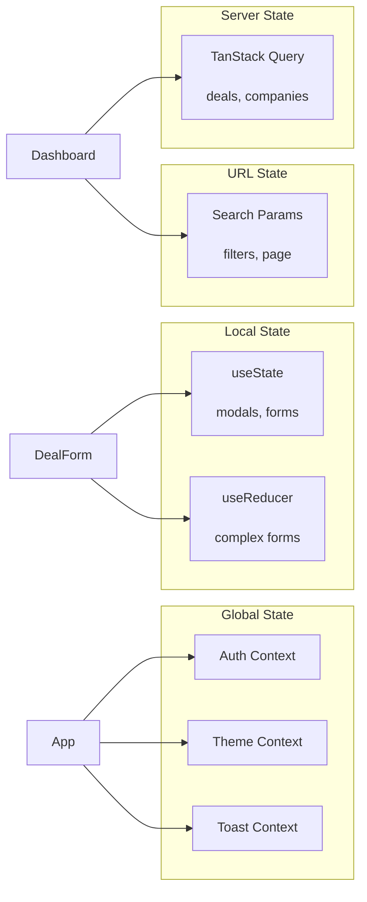

# Component Hierarchy Diagrams

## Full Application Component Tree

```mermaid
graph TD
    A[RootLayout] --> B[AppLayout]
    B --> C[Sidebar]
    B --> D[TopNav]
    B --> E[MainContent]
    
    E --> F[DashboardPage]
    E --> G[DealsPage]
    E --> H[CompaniesPage]
    E --> I[AgentsPage]
    E --> J[SettingsPage]
    
    F --> F1[StatsCards]
    F --> F2[PortfolioChart]
    F --> F3[RecentActivity]
    
    G --> G1[PipelineBoard]
    G --> G2[DealTable]
    G1 --> G1a[DealCard]
    G1a --> G1a1[Card]
    G1a1 --> G1a1a[CardHeader]
    G1a1 --> G1a1b[CardContent]
    
    H --> H1[CompanyTable]
    H --> H2[CompanyFilters]
    
    I --> I1[AgentControlPanel]
    I --> I2[AgentLogs]
    I1 --> I1a[AgentCard]
    
    J --> J1[SettingsForm]
    J --> J2[UserManagement]
    
    C --> C1[NavItem]
    C --> C2[UserProfile]
    
    D --> D1[GlobalSearch]
    D --> D2[Notifications]
    D --> D3[ThemeToggle]
```

## Atomic Design Hierarchy

```mermaid
graph TD
    subgraph Atoms
        A1[Button]
        A2[Input]
        A3[Badge]
        A4[Avatar]
        A5[Icon]
    end
    
    subgraph Molecules
        M1[SearchInput]
        M1 --> A2
        M1 --> A5
        
        M2[UserBadge]
        M2 --> A4
        M2 --> A3
        
        M3[StatCard]
        M3 --> A1
        
        M4[DealListItem]
        M4 --> A3
        M4 --> A1
    end
    
    subgraph Organisms
        O1[DealTable]
        O1 --> M4
        O1 --> A1
        
        O2[Sidebar]
        O2 --> M2
        
        O3[PipelineColumn]
        O3 --> M4
    end
    
    subgraph Templates
        T1[AppLayout]
        T1 --> O2
        
        T2[DashboardLayout]
        T2 --> T1
    end
    
    subgraph Pages
        P1[Dashboard]
        P1 --> T2
        P1 --> O1
    end
```

## Component Dependencies

```mermaid
graph LR
    subgraph Data Layer
        D1[useDeals]
        D2[useCompanies]
        D3[useAgents]
    end
    
    subgraph Feature Components
        F1[DealTable]
        F1 --> D1
        
        F2[CompanyList]
        F2 --> D2
        
        F3[AgentPanel]
        F3 --> D3
    end
    
    subgraph UI Components
        U1[DataTable]
        U2[Card]
        U3[Button]
        U4[Badge]
    end
    
    F1 --> U1
    F1 --> U2
    F1 --> U3
    F1 --> U4
    
    F2 --> U1
    F2 --> U2
    
    F3 --> U2
    F3 --> U3
```

## Server vs Client Components

```mermaid
graph TD
    subgraph Server Components
        S1[Page Components]
        S2[Layout Components]
        S3[Data Fetching
            <br/>getDeals, getCompanies]
    end
    
    subgraph Client Components
        C1[Interactive UI
            <br/>'use client']
        C2[Browser APIs
            <br/>localStorage, WebSocket]
        C3[Event Handlers
            <br/>onClick, onSubmit]
        C4[React State
            <br/>useState, useEffect]
    end
    
    S1 --> C1
    S1 --> S3
    C1 --> C3
    C1 --> C4
    C1 -.->|may use| C2
```

## State Management by Component

```mermaid
graph LR
    subgraph Global State
        G1[Auth Context]
        G2[Theme Context]
        G3[Toast Context]
    end
    
    subgraph Server State
        S1[TanStack Query
            <br/>deals, companies]
    end
    
    subgraph Local State
        L1[useState
            <br/>modals, forms]
        L2[useReducer
            <br/>complex forms]
    end
    
    subgraph URL State
        U1[Search Params
            <br/>filters, page]
    end
    
    App --> G1
    App --> G2
    App --> G3
    
    Dashboard --> S1
    Dashboard --> U1
    
    DealForm --> L1
    DealForm --> L2
```
