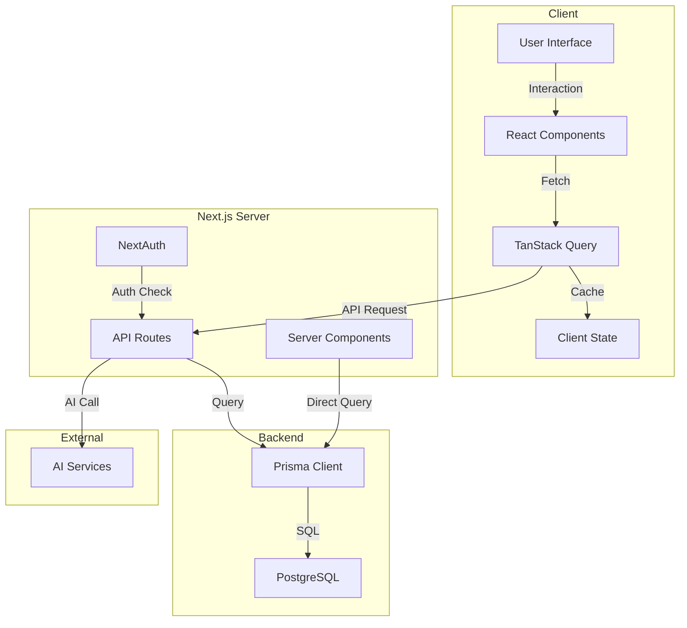
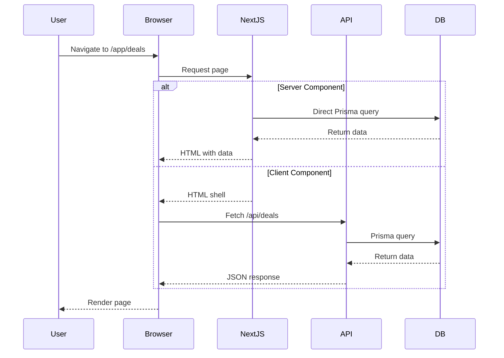
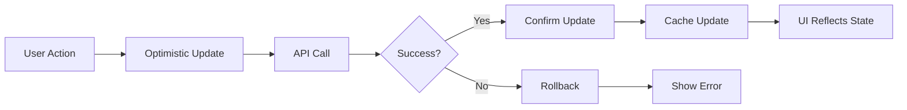
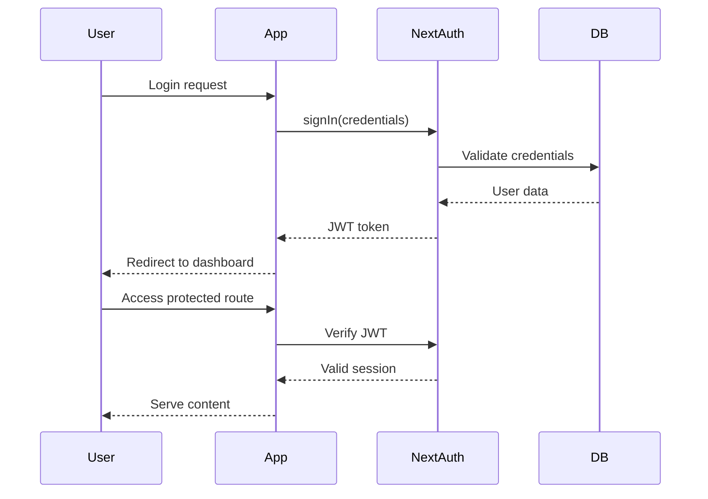
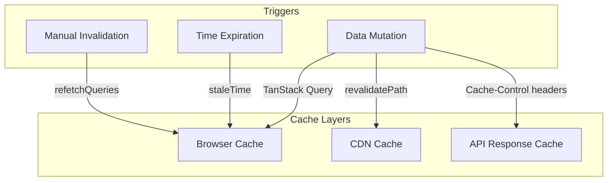
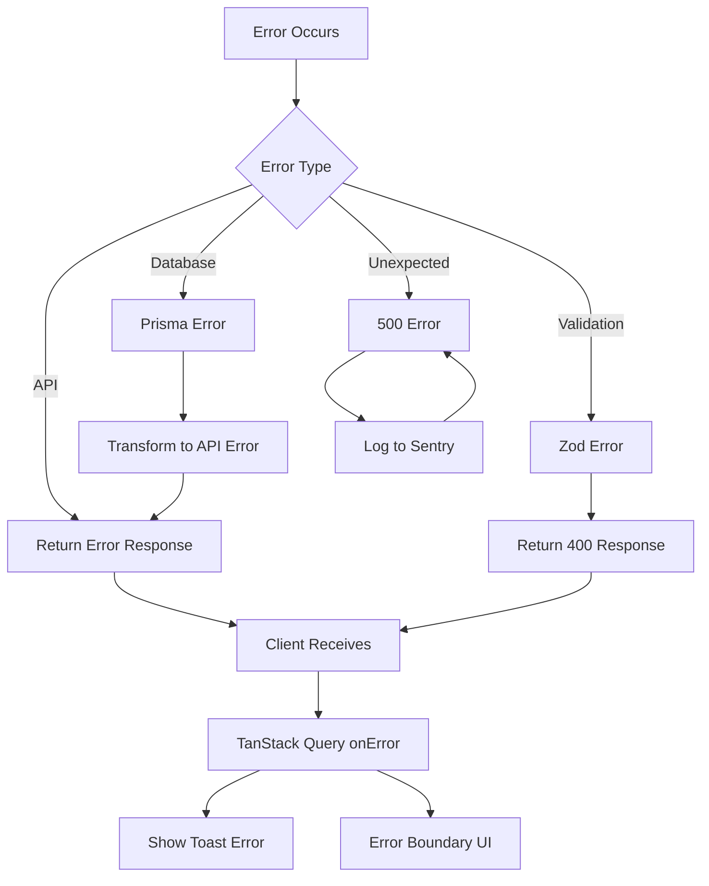

# Data Flow Diagrams

## System Architecture Data Flow



## Request Lifecycle Flow



## State Synchronization Flow



## Authentication Data Flow



## Data Fetching Patterns

### Server Component Pattern
```
┌─────────────────────────────────────────┐
│  Server Component                       │
│  ┌─────────────────────────────────────┐│
│  │ async function Page() {             ││
│  │   const data = await prisma.deal    ││
│  │     .findMany();                     ││
│  │   return <DealList deals={data} />; ││
│  │ }                                   ││
│  └─────────────────────────────────────┘│
└─────────────────────────────────────────┘
```

### Client Component Pattern
```
┌─────────────────────────────────────────┐
│  Client Component                       │
│  'use client'                           │
│  ┌─────────────────────────────────────┐│
│  │ function Page() {                   ││
│  │   const { data } = useQuery({       ││
│  │     queryKey: ['deals'],            ││
│  │     queryFn: fetchDeals             ││
│  │   });                               ││
│  │   return <DealList deals={data} />; ││
│  │ }                                   ││
│  └─────────────────────────────────────┘│
└─────────────────────────────────────────┘
```

### Hybrid Pattern
```
┌──────────────────────────────────────────────┐
│  Server Component                            │
│  ┌─────────────────────────────────────────┐ │
│  │ async function Page() {                 │ │
│  │   const initial = await prisma.deal     │ │
│  │     .findMany();                        │ │
│  │   return (                              │ │
│  │     <DealListClient                     │ │
│  │       initialDeals={initial}            │ │
│  │     />                                  │ │
│  │   );                                    │ │
│  │ }                                       │ │
│  └─────────────────────────────────────────┘ │
└──────────────────────────────────────────────┘
         │
         ▼
┌──────────────────────────────────────────────┐
│  Client Component                            │
│  'use client'                                │
│  ┌─────────────────────────────────────────┐ │
│  │ function DealListClient({               │ │
│  │   initialDeals                          │ │
│  │ }) {                                    │ │
│  │   const { data } = useQuery({           │ │
│  │     queryKey: ['deals'],                │ │
│  │     queryFn: fetchDeals,                │ │
│  │     initialData: initialDeals           │ │
│  │   });                                   │ │
│  │   return <DealList deals={data} />;     │ │
│  │ }                                       │ │
│  └─────────────────────────────────────────┘ │
└──────────────────────────────────────────────┘
```

## Cache Invalidation Strategy



## Error Handling Flow


